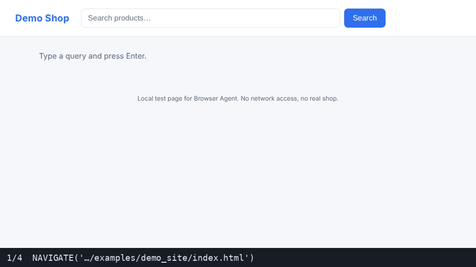
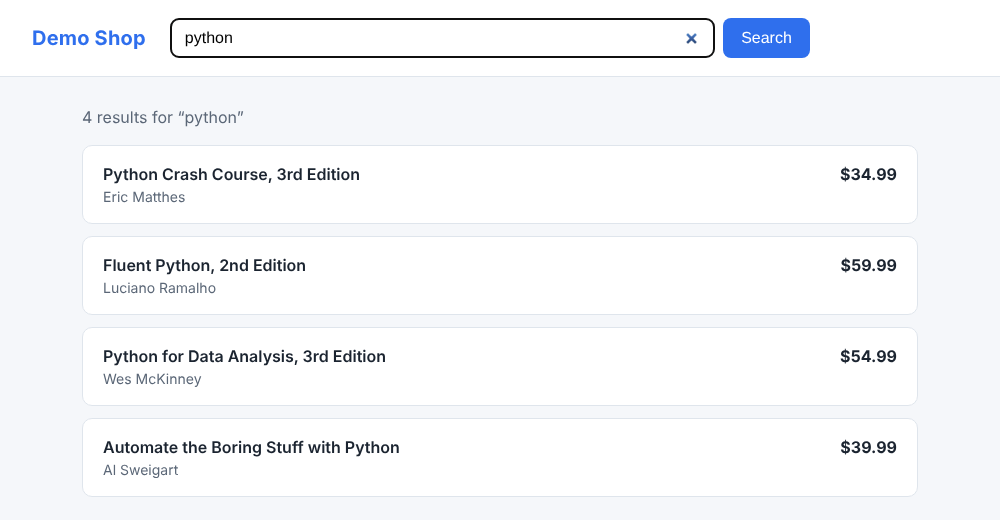
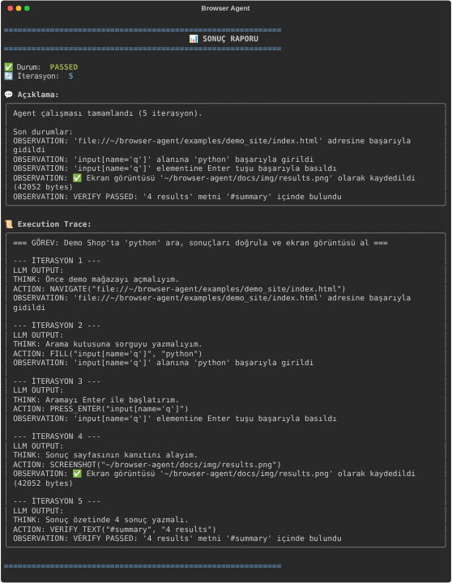
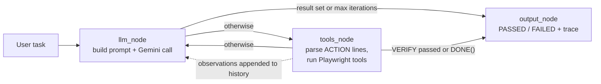

# 🤖 Browser Agent — ReAct + LangGraph + Playwright

[](https://github.com/mehmetarifkuzgun/Browser-Agent-with-ReAct-LangGraph/actions/workflows/ci.yml)


🇬🇧 English · 🇹🇷 [Türkçe](README.tr.md)

A small, readable browser-automation agent. You give it a task in natural language (Turkish or English); an LLM reasons step by step (**ReAct**: *Think → Act → Observe*), drives a real Chromium through **Playwright** tools, verifies the outcome, and reports `PASSED` / `FAILED` with a full execution trace. The control loop is available both as a plain Python loop and as a **LangGraph** `StateGraph`.



*Real run of the agent loop in a real browser (see [Try it without an API key](#try-it-without-an-api-key) for exactly what is real and what is scripted).*

| Browser state at the end of the run | Result report printed by the CLI |
|---|---|
|  |  |

## Why this project

It is intentionally small (under 800 lines of Python) so the whole agent is easy to read end to end: prompt construction, action parsing, tool execution, stop conditions and evaluation are each one short function. It is a good starting point for experimenting with agent loops, not a production RPA framework (see [Known limitations](#known-limitations)).

## Architecture



| File | Responsibility |
|---|---|
| `main.py` | Rich CLI, env validation, runs either mode, prints the report |
| `agent_logic.py` | `GeminiLLM` wrapper, `ReActAgent` (prompt, quote-aware action parser, action routing, plain loop, evaluation) |
| `langgraph_graph.py` | Same loop as a LangGraph `StateGraph` (`llm_node` → `tools_node` → `output_node`) |
| `tools.py` | `BrowserTools`: `click`, `fill`, `select`, `verify_text`, `screenshot`, `press_enter`, `navigate`, `wait` — each returns `{success, message, action}` |
| `examples/offline_demo.py` | Deterministic, key-less demo used to produce the images above |
| `tests/` | pytest suite (see [Tests](#tests)) |

**Action language** the model must emit, one `ACTION:` per turn:
`NAVIGATE("url")`, `CLICK("selector")`, `FILL("selector", "text")`, `SELECT("selector", "value")`, `VERIFY_TEXT("selector", "expected")`, `PRESS_ENTER("selector")`, `WAIT(ms)`, `SCREENSHOT("path")`, `DONE()`.

**Stopping rules:** the run ends on `DONE()`, or as soon as a `VERIFY_TEXT` passes (graph mode; simple mode additionally requires a screenshot to have been taken), or after `max_iterations` (10 in the CLI). Status is `PASSED` only if a verification actually passed.

## Quick start

```bash
git clone https://github.com/mehmetarifkuzgun/Browser-Agent-with-ReAct-LangGraph.git
cd Browser-Agent-with-ReAct-LangGraph
python -m venv .venv && source .venv/bin/activate      # Windows: .venv\Scripts\activate
pip install -r requirements.txt
playwright install chromium

cp .env.example .env        # then put your Gemini API key in .env
python main.py "Go to https://example.com and verify the heading says Example Domain"
```

Without an argument the CLI asks for the task and lets you pick *simple ReAct loop* or *LangGraph* (default). Set `HEADLESS=true` in `.env` to hide the browser window. More prompts in [`examples/prompts.txt`](examples/prompts.txt).

## Try it without an API key

```bash
pip install -r requirements-dev.txt
playwright install chromium
python examples/offline_demo.py                 # both modes, prints results
python examples/offline_demo.py --mode graph --out docs/img   # regenerate the README images
```

What is **real** in this demo: the Playwright browser, the `BrowserTools`, the action parser, the agent loop / LangGraph graph, the evaluation, and the CLI report. What is **scripted**: the LLM — a `ScriptedLLM` replays a fixed sequence of `THINK/ACTION` replies, and the target is a bundled local page ([`examples/demo_site`](examples/demo_site/index.html)), not a live website. So the images show the machinery working, **not** Gemini's planning quality on real sites. The same demo runs in CI on every push.

## Tests

```bash
pip install -r requirements-dev.txt && playwright install chromium
pytest -q
```

19 tests, no API key needed: action parsing (including regression tests for selectors with inner quotes and bare `WAIT(2000)` arguments), action routing and error paths, the simple loop and the LangGraph flow with a scripted LLM and fake tools (incl. correct iteration counts, `DONE()`, and "no LLM call after the task finished"), and `BrowserTools` against the demo page in real headless Chromium (skipped automatically if no browser is installed). CI runs them on Python 3.11 / 3.12 / 3.13 plus the offline demo.

## Known limitations

- **No page perception.** The model never sees the DOM or a screenshot; it guesses CSS selectors from its prompt hints and its training data, and recovers only through error observations. Sites that change markup, require login, show consent walls or use bot protection will often fail. (Feeding a trimmed DOM / accessibility tree or screenshots back into the prompt is the obvious next step.)
- **Not evaluated on live sites.** There is no benchmark here; the offline demo proves the loop, tools and graph work, not that the agent succeeds on arbitrary websites.
- **One action per turn**, no parallel tool calls, no memory beyond the last 10 history lines in the prompt.
- **Gemini SDK is deprecated upstream.** `google-generativeai` still works (tested 0.8.6) but prints a deprecation warning; migrating to `google-genai` is a small change confined to `GeminiLLM`.
- **Safety:** the agent clicks and types whatever the model decides. Don't point it at accounts or flows with real side effects (purchases, deletions).
- Prompt and CLI text are Turkish; the model can be given English tasks too.

## License

MIT — see [LICENSE](LICENSE).
