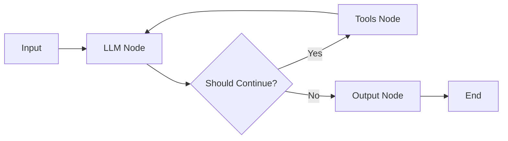

# 🤖 Browser Agent

**Python + LangGraph + Playwright** ile geliştirilmiş, Türkçe doğal dil komutlarını alıp browser otomasyonu yapan yapay zeka ajanı.

## 📋 İçindekiler

- [Genel Bakış](#genel-bakış)
- [Özellikler](#özellikler)
- [Mimari](#mimari)
- [Kurulum](#kurulum)
- [Kullanım](#kullanım)
- [ReAct Döngüsü](#react-döngüsü)
- [LangGraph Yapısı](#langgraph-yapısı)
- [Genişletme Önerileri](#genişletme-önerileri)
- [Sorun Giderme](#sorun-giderme)

---

## 🎯 Genel Bakış

Bu proje, Türkçe doğal dil promptlarını alarak web tarayıcısı üzerinde otomasyon yapan bir AI ajanıdır. **ReAct (Reasoning + Acting)** pattern'ini kullanarak, LLM'nin düşünce sürecini ve aksiyonlarını şeffaf bir şekilde takip edebilirsiniz.

### Amaç

Kullanıcıdan aldığı doğal dil komutunu (örn. "Hepsiburada'da laptop ara ve sepete ekle") otomatik olarak browser aksiyonlarına çevirerek gerçekleştirmek.

---

## ✨ Özellikler

- ✅ **Türkçe doğal dil desteği**
- ✅ **ReAct pattern** (THINK → ACTION → OBSERVATION döngüsü)
- ✅ **LangGraph orchestration** (state graph yönetimi)
- ✅ **Playwright browser automation**
- ✅ **Google Gemini LLM** (free tier)
- ✅ **Zengin CLI interface** (Rich kütüphanesi ile)
- ✅ **Detaylı execution trace**
- ✅ **PASSED/FAILED evaluation**

---

## 🏗️ Mimari

### Proje Yapısı

```
browser-agent/
├── README.md              # Bu dosya
├── requirements.txt       # Python bağımlılıkları
├── .env.example          # Örnek environment variables
├── main.py               # Ana CLI uygulaması
├── tools.py              # Playwright browser tools
├── agent_logic.py        # ReAct döngüsü + LLM wrapper
├── langgraph_graph.py    # LangGraph state graph
└── examples/
    └── prompts.txt       # Örnek promptlar
```

### Katmanlar

1. **main.py**: CLI interface, kullanıcı etkileşimi
2. **langgraph_graph.py**: LangGraph ile orchestration
3. **agent_logic.py**: ReAct döngüsü, LLM entegrasyonu
4. **tools.py**: Playwright ile browser operasyonları

---

## 🚀 Kurulum

### 1. Gereksinimler

- Python 3.9+
- pip
- Internet bağlantısı

### 2. Repository'yi Klonlayın

```bash
cd browser-agent
```

### 3. Virtual Environment Oluşturun (Önerilen)

```powershell
python -m venv venv
.\venv\Scripts\Activate.ps1
```

### 4. Bağımlılıkları Kurun

```powershell
pip install -r requirements.txt
```

### 5. Playwright Chromium Kurun

**ÖNEMLİ:** Playwright'ın browser binary'lerini indirmelisiniz:

```powershell
playwright install chromium
```

### 6. Environment Variables Ayarlayın

```powershell
# .env.example dosyasını .env olarak kopyalayın
cp .env.example .env

# .env dosyasını düzenleyin ve API key ekleyin
notepad .env
```

**.env içeriği:**

```env
GEMINI_API_KEY=your_actual_api_key_here
HEADLESS=false
BROWSER_TIMEOUT=30000
```

**Gemini API Key nasıl alınır?**

1. [Google AI Studio](https://makersuite.google.com/app/apikey) adresine gidin
2. Google hesabınızla giriş yapın
3. "Create API Key" butonuna tıklayın
4. Oluşan key'i kopyalayıp `.env` dosyasına yapıştırın

---

## 🎮 Kullanım

### Temel Kullanım

```powershell
python main.py
```

Çalıştırdığınızda:
1. Banner gösterilir
2. Görev girmeniz istenir
3. Mod seçimi yaparsınız (Basit ReAct / LangGraph)
4. Agent çalışır ve sonuçları gösterir

### Komut Satırından Direkt Görev Verme

```powershell
python main.py "Google'da Python ara"
```

### Örnek Çıktı

```
╔═══════════════════════════════════════════════════════╗
║                                                       ║
║           🤖 BROWSER AGENT 🤖                        ║
║                                                       ║
║        Python + LangGraph + Playwright               ║
║        ReAct Pattern Implementation                  ║
║                                                       ║
╚═══════════════════════════════════════════════════════╝

✅ API Key doğrulandı

📝 Görev Girin:
👉 Google'da Python ara ve ilk sonuca tıkla

🚀 Agent başlatılıyor...

📊 SONUÇ RAPORU
✅ Durum: PASSED
🔄 İterasyon: 3
```

---

## 🧠 ReAct Döngüsü

Bu projede **ReAct (Reasoning + Acting)** pattern'i şu şekilde uygulanmıştır:

### Döngü Adımları

```
1. THINK (Reasoning)
   ↓
   LLM mevcut durumu analiz eder ve strateji belirler

2. ACTION (Acting)
   ↓
   LLM bir veya daha fazla action üretir:
   - NAVIGATE("url")
   - CLICK("selector")
   - FILL("selector", "text")
   - VERIFY_TEXT("selector", "expected")

3. OBSERVATION (Feedback)
   ↓
   Her action çalıştırılır ve sonuç history'e eklenir

4. THINK (Yeniden Değerlendirme)
   ↓
   History ile birlikte LLM'e geri döner
   ↓
   Döngü tekrarlanır (max 3 iterasyon)
```

### Kod Örneği

```python
# agent_logic.py içinde
def run(self, user_task: str) -> Dict[str, Any]:
    for iteration in range(self.max_iterations):
        # 1. THINK - LLM'den plan al
        llm_output = self.llm.generate(prompt)
        
        # 2. ACTION - Parse et
        actions = self.parse_actions(llm_output)
        
        # 3. OBSERVATION - Çalıştır ve kaydet
        for action_name, args in actions:
            result = self.execute_action(action_name, args)
            self.history.append(f"OBSERVATION: {result['message']}")
        
        # 4. History ile tekrar THINK
```

### Action Parsing

LLM'den gelen çıktı şu formatta parse edilir:

```
THINK: Önce Google'a gitmem gerekiyor.
ACTION: NAVIGATE("https://www.google.com")

THINK: Arama kutusunu bulup 'Python' yazmalıyım.
ACTION: FILL("input[name='q']", "Python")
ACTION: PRESS_ENTER("input[name='q']")
```

Regex pattern ile ACTION satırları yakalanır ve ilgili tool fonksiyonlarına map edilir.

---

## 📊 LangGraph Yapısı

LangGraph, agent'ın state yönetimini ve akışını organize eder.

### State Graph Akışı



### Node Açıklamaları

1. **LLM Node**: 
   - LLM'den reasoning ve action planı alır
   - State'e AIMessage olarak ekler

2. **Tools Node**:
   - LLM'nin ürettiği action'ları parse eder
   - Her action için ilgili tool'u çağırır
   - Sonuçları FunctionMessage olarak state'e ekler

3. **Decision Point** (`should_continue`):
   - Max iteration'a ulaşıldı mı?
   - Verification geçti mi?
   - ACTION var mı?

4. **Output Node**:
   - Final evaluation yapar
   - PASSED/FAILED sonucunu döndürür

### Kod Yapısı

```python
# langgraph_graph.py
class BrowserAgentGraph:
    def _build_graph(self):
        workflow = Graph()
        
        # Node'ları ekle
        workflow.add_node("llm_node", self._llm_node)
        workflow.add_node("tools_node", self._tools_node)
        workflow.add_node("output_node", self._output_node)
        
        # Edge'leri tanımla
        workflow.set_entry_point("llm_node")
        workflow.add_conditional_edges(
            "llm_node",
            self._should_continue,
            {"continue": "tools_node", "end": "output_node"}
        )
        workflow.add_edge("tools_node", "llm_node")
        workflow.add_edge("output_node", END)
        
        return workflow.compile()
```

---

## 🛠️ Genişletme Önerileri

### 1. Multi-Modal Support

Ekran görüntülerini LLM'e göndererek görsel reasoning ekleyin:

```python
# Gemini Vision API kullanarak
def analyze_screenshot(self, image_path: str) -> str:
    # Screenshot'u Gemini'ye gönder
    # "Bu sayfada ne görüyorsun?" sorusunu sor
    pass
```

### 2. Memory & Context

Uzun conversation history için vector database ekleyin:

```python
from langchain.vectorstores import FAISS
from langchain.embeddings import OpenAIEmbeddings

# Önceki observation'ları semantic search ile getir
```

### 3. Error Recovery

Hata durumlarında retry mekanizması:

```python
def execute_with_retry(self, action, max_retries=3):
    for attempt in range(max_retries):
        result = self.execute_action(action)
        if result["success"]:
            return result
        # LLM'den alternative action iste
```

### 4. Parallel Actions

Bağımsız action'ları paralel çalıştırın:

```python
import asyncio

async def execute_actions_parallel(self, actions):
    tasks = [self.execute_async(action) for action in actions]
    results = await asyncio.gather(*tasks)
    return results
```

### 5. Custom Tools

Domain-specific tool'lar ekleyin:

```python
# tools.py içinde
def extract_table_data(self, selector: str) -> Dict[str, Any]:
    """Tablodaki verileri JSON olarak çıkar"""
    pass

def fill_form(self, form_data: dict) -> Dict[str, Any]:
    """Form alanlarını otomatik doldur"""
    pass
```

---

## 🐛 Sorun Giderme

### Problem: "GEMINI_API_KEY bulunamadı"

**Çözüm:**
```powershell
# .env dosyasını kontrol edin
cat .env

# Eğer yoksa oluşturun
cp .env.example .env
notepad .env
```

### Problem: "playwright._impl._api_types.Error: Executable doesn't exist"

**Çözüm:**
```powershell
# Playwright browser'ları kurun
playwright install chromium
```

### Problem: "ModuleNotFoundError: No module named 'langgraph'"

**Çözüm:**
```powershell
# Bağımlılıkları yeniden kurun
pip install -r requirements.txt
```

### Problem: LLM'den ACTION gelmiyor

**Çözüm:**
- Prompt'u kontrol edin (`agent_logic.py` → `build_prompt()`)
- LLM sıcaklık parametresini düşürün
- Gemini API limitine ulaşmış olabilirsiniz (quota kontrol edin)

### Problem: Selector bulunamıyor

**Çözüm:**
```python
# Timeout artırın (.env)
BROWSER_TIMEOUT=60000

# Veya WAIT action kullanın
ACTION: WAIT(2000)
ACTION: CLICK("selector")
```

---

## 📚 Referanslar

- [Playwright Docs](https://playwright.dev/python/)
- [LangGraph Docs](https://python.langchain.com/docs/langgraph)
- [Google Gemini API](https://ai.google.dev/docs)
- [ReAct Paper](https://arxiv.org/abs/2210.03629)

---

## 📄 Lisans

Bu proje eğitim amaçlı geliştirilmiştir. Ücretsiz kullanabilir ve değiştirebilirsiniz.

---

## 👤 Yazar

Browser Agent - ReAct Pattern Implementation

---

## 🙏 Katkıda Bulunma

Pull request'ler kabul edilir. Büyük değişiklikler için lütfen önce bir issue açın.

---

**Keyifli kodlamalar! 🚀**
